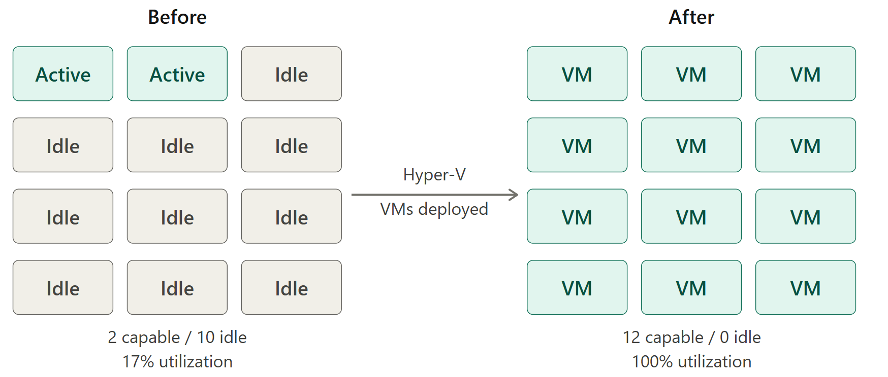
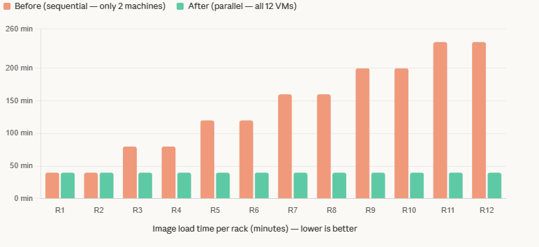

# ⚙️ Kaizen Case Study — VM Infrastructure for Test Services

**Role:** Kaizen Leader / Test Engineer
**Methodology:** Kaizen (Continuous Improvement)
**Year:** 2021
**Team size:** 6 (1 leader, 1 co-leader, 1 lean facilitator, 3 technicians)

---

## 📋 Executive Summary

A Kaizen initiative that solved a critical infrastructure bottleneck in a server rack testing area by deploying Hyper-V virtual machines on existing hardware — eliminating the need to purchase new equipment while recovering **83% of idle testing capacity** and saving **$6,000 USD annually**.

---

## 🔴 Problem Statement

During Q1/Q2 2021, a hardware audit of the test area revealed a severe capacity constraint:

> **Only 2 out of 12 available workstations** met the minimum hardware requirements to run the test image loading service. The remaining 10 machines were effectively idle for this critical step of the workflow.

### Root Causes

| Constraint | Impact |
|---|---|
| Insufficient CPU/RAM on 10 of 12 machines | Could not load the test image required for rack testing |
| Manual network and IP reconfiguration required per machine | Added setup time and introduced human error |
| Only 2 qualified machines shared across all racks | Created a sequential bottleneck — racks had to wait for a machine to free up |

### By the Numbers — Before

Because only 2 machines could perform the image loading step, each additional rack had to wait for the previous one to finish. Load time accumulated linearly:

| Rack | Image Load Time | Total Process Time |
|---|---|---|
| Rack 1–2 | 40 min | ~10h 45m |
| Rack 3–4 | 80 min | ~11h 25m |
| Rack 5–6 | 120 min | ~12h 05m |
| Rack 7–8 | 160 min | ~12h 45m |
| Rack 9–10 | 200 min | ~13h 25m |
| Rack 11–12 | 240 min | ~14h 05m |

> The last rack in the queue waited **4 hours** just for image loading — before any actual testing began.

---



---
## 💡 Solution

Deploy **Hyper-V virtual machines** on the existing thin client workstations, configured with the hardware profile required by the test image loading service.

### Key Design Decisions

- **No new hardware purchased** — VMs were provisioned on the 10 previously idle machines using Hyper-V, leveraging the host's existing resources
- **Dual network interface per VM** — each VM was pre-configured with both required network interfaces, eliminating the manual IP/network reconfiguration step entirely
- **Standardized VM template** — all 10 VMs were deployed from the same base image, ensuring consistency across machines and operators
- **Scalable** — adding capacity requires only deploying an additional VM, not procuring hardware

### Architecture

```
Physical Workstation (thin client)
└── Hyper-V Host
    └── VM Instance
        ├── Network Interface A → Test Network
        └── Network Interface B → Management Network
```

---

## ✅ Results — Before vs. After

| Metric | Before | After | Improvement |
|---|---|---|---|
| Machines available for image loading | 2 of 12 | 12 of 12 | **+500%** |
| Image load time per rack | 40–240 min (cumulative) | 40 min (flat) | **Up to 83% reduction** |
| Manual network reconfiguration | Required per machine | Eliminated | **100% removed** |
| Hardware purchase required | Yes (estimated) | No | **$6,000 USD saved** |
| Equipment utilization | 17% | 100% | **+83%** |



---
### Process Time — After

With all 12 machines capable of parallel image loading:

| Rack | Image Load Time | Total Process Time |
|---|---|---|
| All 12 racks | 40 min (each, parallel) | ~10h 45m |

Every rack now completes image loading in the same 40 minutes, regardless of queue position.


## 📊 Financial Impact

| Type | Annual Estimate |
|---|---|
| Hardware avoided (fat client procurement) | $6,000 USD |
| Labor time recovered (cumulative load time reduction) | Not formally calculated |

---

## 🔄 Workflow Comparison

### Before
```
Rack arrives → Wait for available workstation → Manual IP/network config
→ Load test image (40 min) → Run tests → Upload logs
(Next rack waits until workstation is free — adds 40 min per rack in queue)
```

### After
```
Rack arrives → Connect to assigned VM (pre-configured)
→ Load test image (40 min, parallel across all racks) → Run tests → Upload logs
(No waiting — all 12 racks load simultaneously)
```

---

## 🗂️ Methodology — Kaizen

This project followed the **Kaizen (改善)** continuous improvement framework:

| Phase | Action |
|---|---|
| **Define** | Identified that 83% of machines were unable to perform a critical workflow step |
| **Measure** | Quantified cumulative wait times per rack and hardware gap across 12 machines |
| **Analyze** | Root cause: hardware requirements exceeded what thin clients could provide natively |
| **Improve** | Deployed Hyper-V VMs with the correct hardware profile on all 10 idle machines |
| **Control** | Standardized VM template ensures all future deployments are consistent |

---

## 🛠️ Tech Stack

| Component | Technology |
|---|---|
| Virtualization | Microsoft Hyper-V |
| Host hardware | Thin client workstations |
| Network config | Dual virtual network interfaces per VM |
| Deployment | Standardized VM template |

---

## 📌 Lessons Learned

**What worked well:**
- Reusing existing hardware avoided procurement delays and budget approval cycles
- Standardizing from a single VM template eliminated configuration drift between machines
- The dual network interface approach removed an entire manual step from the workflow

**What could have been improved:**
- Automated VM provisioning — scripted deployment instead of manual template cloning
- Formal monitoring of VM health and resource utilization post-deployment
- Knowledge transfer documentation to ensure continuity after team changes

**What happened after:**
The solution was successfully implemented and validated in production. After the project owner transitioned to a different area, the initiative was not continued or expanded — a common challenge for grassroots improvement projects without dedicated ownership at the leadership level.

---

## 👨‍💻 Author

**Fernando Martinez Barbosa**
- LinkedIn: www.linkedin.com/in/fernando-martinez-barbosa-643894142
- GitHub: [@fmartinez-cli](https://github.com/fmartinez-cli)

---

> _The most effective infrastructure improvement isn't always buying new hardware — sometimes it's fully utilizing what you already have._
